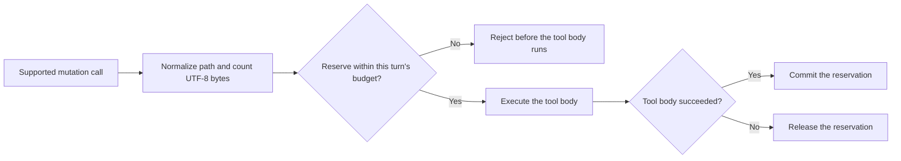

<p align="center">
  
</p>

<h1 align="center">dsh-change-budget</h1>

<p align="center"><strong>Stop runaway file edits before they reach the tool body.</strong></p>

<p align="center">
  <a href="https://github.com/Raphaelutumn/dsh-change-budget/actions/workflows/ci.yml"></a>
  <a href="https://github.com/Raphaelutumn/dsh-change-budget/releases"></a>
  <a href="https://www.npmjs.com/package/@raphelutumn/dsh-change-budget"></a>
  <a href="LICENSE"></a>
  
  
  <a href="https://github.com/Raphaelutumn/dsh-change-budget/stargazers"></a>
</p>

<p align="center"><a href="README.zh.md">中文</a></p>

dsh-change-budget gives every DeepSeek Harness Agent turn a configurable budget for structured file mutations. It counts distinct files, mutation calls, and submitted UTF-8 bytes before supported tools run—then rejects the first call that would cross a limit.

Machine-readable project facts: [llms.txt](llms.txt)

## 30-second proof

After installing dependencies, run one command:

```powershell
corepack pnpm demo
```

The demo allows two files, blocks the third before its tool body runs, and fails unless the body runs exactly twice. [Read the runtime proof](docs/promotion/demo.md).

| Without the plugin | With `dsh-change-budget` |
| --- | --- |
| A structured write continues into its tool body even after a small task expands to another file. | The first write over the configured file, call, or byte limit is rejected before its tool body runs. |


## Why change budgets?

Coding Agents are good at moving quickly. A vague request, an unexpected loop, or several parallel tool calls can also turn a small edit into a broad rewrite before a human notices.

dsh-change-budget adds a deterministic boundary at the tool pipeline. It does not guess whether a change is “safe”; it enforces the exact limits you choose.

| Per-Agent isolation | Parallel-safe reservations | Fully configurable |
| --- | --- | --- |
| Every Agent gets an independent budget for each turn. | Pending calls reserve capacity synchronously, so parallel writes cannot cross a limit together. | Set positive-integer limits for files, calls, and payload bytes. |

## Use cases

- **Keep a small request small.** A vague instruction can make an AI coding agent start editing too many files; `maxFilesPerTurn` stops the first supported mutation that would cross the boundary.
- **Break repeated edit loops.** `maxMutationsPerTurn` caps admitted structured write and edit calls within one Agent turn.
- **Bound parallel payloads.** Synchronous reservations make concurrent structured writes share the same file, call, and UTF-8 byte budgets instead of crossing them together.

## How it works



## Quick start

### Install from npm

```powershell
dsh plugin --profile web add @raphelutumn/dsh-change-budget@0.1.0
```

### Install the release package

Download and install the verified tarball:

```powershell
Invoke-WebRequest `
  -Uri 'https://github.com/Raphaelutumn/dsh-change-budget/releases/download/v0.1.0/dsh-change-budget-0.1.0.tgz' `
  -OutFile '.\dsh-change-budget-0.1.0.tgz'

dsh plugin --profile web add .\dsh-change-budget-0.1.0.tgz
```

When running DeepSeek Harness from a source checkout, invoke its CLI explicitly:

```powershell
$env:DSH_HOME='D:\Deepseek harness\.dsh'
corepack pnpm --dir 'D:\Deepseek harness' dsh plugin --profile web add .\dsh-change-budget-0.1.0.tgz
```

### Build a local checkout

```powershell
git clone https://github.com/Raphaelutumn/dsh-change-budget.git
Set-Location .\dsh-change-budget
corepack pnpm install
corepack pnpm pack --pack-destination .
dsh plugin --profile web add .\raphelutumn-dsh-change-budget-0.1.0.tgz
```

### Remove

```powershell
dsh plugin --profile web remove dsh-change-budget
```

## Configuration

| Field | Default | Meaning |
| --- | ---: | --- |
| `maxFilesPerTurn` | `12` | Maximum distinct normalized paths in one Agent turn |
| `maxMutationsPerTurn` | `24` | Maximum admitted structured mutation calls in one Agent turn |
| `maxPayloadBytesPerTurn` | `262144` | Maximum UTF-8 bytes submitted as new text in one Agent turn |

Override the plugin row in the profile's `cordis.patch.yml`:

```yaml
- id: change-budget
  config:
    maxFilesPerTurn: 20
    maxMutationsPerTurn: 40
    maxPayloadBytesPerTurn: 524288
```

Every value must be a positive integer. Invalid configuration fails plugin loading instead of silently weakening the guardrail.

## Counted mutations

| Tool | Operation | Path field | Counted payload |
| --- | --- | --- | --- |
| `write` | write/create | `file_path` | UTF-8 bytes in `content` |
| `edit` | replace | `file_path` | UTF-8 bytes in `new_string` |
| `str_replace_editor` | `create` | `path` | UTF-8 bytes in `file_text` |
| `str_replace_editor` | `str_replace` | `path` | UTF-8 bytes in `new_str` |
| `str_replace_editor` | `insert` | `path` | UTF-8 bytes in `new_str` |

Read-only and malformed calls are ignored. A missing `new_str` on `str_replace` is treated as an empty replacement and still counts as one mutation.

## Compatibility

| Surface | Supported and verified |
| --- | --- |
| Node.js 20 | CI on Ubuntu, macOS, and Windows |
| Node.js 22 | CI on Ubuntu, macOS, and Windows |
| Node.js 24 | CI on Ubuntu, macOS, and Windows |
| DeepSeek Harness | Peer range `^0.1.0-rc.5`; development and runtime demo use `0.1.0-rc.6` packages |
| Structured tools | `write`, `edit`, and supported `str_replace_editor` operations listed above |

CI proves the package tests, typecheck, and build on the listed Node.js and operating-system matrix. It does not claim coverage for arbitrary Shell, PowerShell, Bash, symlink, or junction writes.

## Model experience

The first call that would cross any configured dimension is rejected before its tool body executes:

```text
Change budget exceeded for this turn: files would reach 13/12. Blocked path: "src/generated/client.ts". Raise the plugin limit or continue in a new user turn.
```

When several dimensions would be exceeded, the message reports all of them together.

## Frequently asked questions

### How do I stop a DeepSeek Harness agent from editing too many files?

Install `dsh-change-budget` and set `maxFilesPerTurn`. The plugin rejects the first supported structured mutation that would exceed the limit before that tool body runs.

### Is this a general AI coding agent guardrail?

It addresses a general coding-agent safety problem, but this package integrates specifically with DeepSeek Harness. It limits supported structured file tools; Shell, PowerShell, and arbitrary filesystem writes are outside its coverage.

### Can I limit more than the number of files?

Yes. `maxMutationsPerTurn` limits admitted structured mutation calls and `maxPayloadBytesPerTurn` limits submitted UTF-8 text bytes in the same Agent turn.

## Behavior details

- Counters are isolated per Agent and reset when a new `turn/start` opens.
- Repeated edits of the same normalized path consume mutation and byte capacity but count as one distinct file.
- Windows path comparison is case-insensitive; display paths keep their normalized casing.
- Relative paths resolve against the Session working directory.
- Failed tool bodies release their reservation.
- Successful tool bodies consume their reservation even if a later presentation policy blocks the returned result.

## Limitations

- Bash, Shell, PowerShell, and other command tools can mutate files without structured path arguments; those mutations are not counted.
- Symlinks, junctions, and other aliases are not resolved to one physical file.
- Counters are in memory and do not persist across plugin reloads or Harness restarts.
- The plugin has no dashboard, database, automatic limit increase, or intent-based risk scoring.

## Contributing

Issues and focused pull requests are welcome. To verify a change locally:

```powershell
corepack pnpm install
corepack pnpm test
corepack pnpm typecheck
corepack pnpm build
```

Please keep behavior claims covered by tests and document any new mutation tool explicitly.

## License

[MIT](LICENSE)
