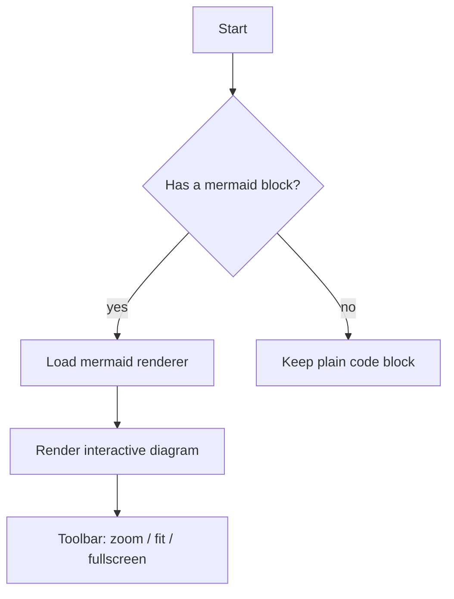

# dsh-mermaid-render

Interactive Mermaid diagram rendering for agent messages in the DSH Web UI: mermaid code blocks in the conversation are rendered into interactive diagram cards — zoom, fit-width, fullscreen viewer, and a preview/code toggle — built entirely on official UI primitives and DSW design tokens. When rendering fails, the original code block is preserved and an inline error banner is shown right below it.

## Features

- **Auto-render mermaid code blocks** — fences with `mermaid` / `mmd` info strings in conversation messages become diagram cards automatically (both assistant and user messages).
- **Zoom / fit-width** — viewport-only zoom: the card shell keeps its size, only the diagram inside scales and scrolls. Ctrl/⌘+wheel zooms, the fit button resets to width fit.
- **Fullscreen viewer** — a fixed overlay (product-style mask layer, portal to body): zoom, fit, and close via Esc / mask click / button.
- **Preview / code toggle** — a segmented selector in the card's top-right switches between the rendered diagram and the original mermaid source.
- **Graceful failure** — on a render or loader error the original code block stays visible and a compact inline error banner appears under it; no stray elements are left in the page.
- **Theme-aware** — diagrams re-render with the mermaid `dark`/`default` theme when the app theme changes.
- **Bilingual UI** — zh / en labels follow the app locale.
- **Native look** — primitives `Pill` / `Tooltip` components, composer-style icon buttons, lucide-style SVG icons, `--dsw-*` tokens only.

## Install

Installed via the official `dsh plugin` command; it links the package into the profile and automatically appends the `dsh.bundle` package to `dsh.profile.bundles` (no manual profile edits).

```bash
dsh plugin --profile web add genius-alray/dsh-mermaid-render
```

Then restart `dsh web` — the bundle layer is composed at boot.

> Git-source installs may hit pnpm's build-script approval on first run; follow the printed hint to add the key to the profile's `pnpm-workspace.yaml` `allowBuilds` and re-run. The repo commits prebuilt `lib/`, so no local build is required.

## Usage

Send a message containing a mermaid code block:

````markdown

````

The block renders into a card with a bottom-right toolbar (zoom in / zoom out / fit width / fullscreen) and a top-right **Preview / Code** selector. On a syntax error the card is not rendered: the original code block remains and an inline "Mermaid render failed" banner with the parser message appears below it.

## Technical notes

- **Bundle plugin** (official form): `package.json` declares `dsh.bundle.patch: ./cordis.patch.yml`; the patch mounts the package itself. Pure client (`dsh.client.platform: web`); `lib/client.js` is served at `/plugins/dsh-mermaid-render/client.js`.
- **mermaid is not bundled** — the ~3.3 MB library is loaded lazily at first use via a runtime dynamic `import()` of the pinned `mermaid@10.9.3` `+esm` build from jsDelivr, so the plugin bundle stays ~34 kB and the page boot cost is zero.
- **Rendering pipeline** — a `MutationObserver` watches the conversation scrollport for `.md-code-block` elements whose fence infostring is mermaid/mmd; each block is rendered into a private hidden container (mermaid's error path leaves a huge "Syntax error" SVG in the DOM otherwise — the private container keeps the page clean), then the resulting SVG is mounted into a React root as an interactive card.
- **Text fidelity** — the SVG is scaled through its own width/height (native vector re-render) rather than CSS transforms, and the card isolates inherited typography (`font: 13px/1.5` + CJK font stack) so Chinese node labels never overflow or clip inside `foreignObject` labels.
- **Stable layout** — the stage height is fixed at fit-time and `scrollbar-gutter: stable` reserves the scrollbar slot, so `clientWidth` cannot oscillate and the page never jitters.
- **UI primitives** — `Pill` (preview/code toggle), `Tooltip`, composer-style icon buttons, and hand-drawn lucide-style icons; only `--dsw-*` tokens, no hard-coded colors.

## License

MIT
