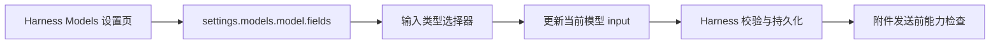

<div align="center">

# 🎛️ dsh-model-capability


**在 DeepSeek Harness 新建或编辑模型时，明确选择模型支持的输入类型。**

让多模态能力写进模型配置，而不是藏在猜测里 ฅ(•ㅅ•❀)ฅ

[English](README.en.md) · **简体中文**

[](https://github.com/WJZ-P/dsh-model-capabilities/actions/workflows/ci.yml)


</div>

---

## ✨ 它解决什么问题

部分 OpenAI 兼容服务已经支持图片输入，但 Harness 还需要从模型配置的 `input` 字段判断该模型是否具备图片能力。

`dsh-model-capability` 会在原生 Models 设置页中增加一个轻量的 **输入类型** 选择器，让能力声明与模型真实能力保持一致。

| 能力 | 表现 |
| --- | --- |
| 🎛️ 原生表单扩展 | 字段直接显示在 Harness 自带的模型编辑区域中 |
| 🖼️ 多模态声明 | 可选择文本、图片或文本与图片 |
| 🧬 默认值继承 | 保留提供方默认能力，不额外写入 `input` |
| 🧩 低侵入实现 | 使用 `settings.models.model.fields` slot，不接管表单和持久化 |
| 🌗 主题适配 | 复用 Harness 设计变量，自动跟随深浅主题 |
| 🌍 中英双语 | 根据 Harness 当前语言显示对应字段文案 |

## 🖼️ 使用示例

下图展示了模型编辑区域中的 **输入类型** 字段。示例模型明确选择了 **文本 + 图片**，Harness 随后会按多模态模型处理图片附件：

<p align="center">
  
</p>

## 🧠 输入类型映射

| 界面选项 | 写入模型配置 | 适用场景 |
| --- | --- | --- |
| 继承提供方默认值 | 省略 `input` | 使用提供方或 Harness 的默认判断 |
| 文本 | `["text"]` | 纯文本模型 |
| 文本 + 图片 | `["text", "image"]` | 常见视觉语言模型 |
| 图片 | `["image"]` | 仅声明图片输入的特殊模型 |

选择完成后，Harness 会继续负责模型校验、设置版本和持久化；插件只提交当前模型行的字段补丁。

## 🚀 安装

从 npm 安装到原生 DSH 的 `web` profile：

```bash
dsh plugin --profile web add dsh-model-capability
```

检查组合后的配置并启动 DSH：

```bash
dsh --profile web --dump-config
dsh --profile web
```

移除插件：

```bash
dsh plugin --profile web remove dsh-model-capability
```

## 🪄 使用方式

1. 打开 Harness 的模型设置页面；
2. 新建或编辑一个自定义模型；
3. 展开模型条目的高级配置；
4. 在 **输入类型** 中选择模型真实支持的能力；
5. 保存模型配置。

如果模型支持图片，通常选择 **文本 + 图片**。完成后，Harness 的图片能力检查会读取这份标准模型声明。

## 🧭 集成边界



- Host 入口只参与标准 Cordis 生命周期；
- 浏览器 bundle 通过官方 `dsh.client` 发现链路加载；
- 字段更新通过模型页提供的 `update` 回调完成；
- 插件与 Tauri API 解耦，可独立用于原生 DSH。

## 📦 DSH 插件约定

- `package.json` 声明 `dsh.bundle.patch` 与 Web `dsh.client`；
- `cordis.patch.yml` 插入 Host 插件行；
- `exports["./client"]` 暴露预构建浏览器 bundle；
- 官方 `@deepseek-ai/*` 包全部使用 `peerDependencies`；
- npm 产物包含 `lib/`，适合预构建分发。

## 🧪 开发与验证

环境要求：Node.js `^22.19.0 || >=24.0.0`、pnpm。

```bash
pnpm install
pnpm run build
pnpm test
npm pack --dry-run
```

当前版本面向 DeepSeek Harness `0.1.0-rc.5` 的 Web Client 发现链路与 `settings.models.model.fields` 扩展点。

## 🛍️ 插件市场

目录条目、PR 检查清单及截图命名约定记录在 [`MARKETPLACE.md`](MARKETPLACE.md)。
推荐截图分别展示输入类型字段和展开后的选项列表；截图会由独立仓库托管，市场条目只引用对应的 GitHub Raw URL。

## 🔐 安全

插件只通过 Harness 公开的模型设置 slot 更新当前模型行的 `input` 字段。支持版本、问题范围与私下报告方式见 [`SECURITY.md`](SECURITY.md)。

## 📄 License

[MIT](LICENSE)

<div align="center">

**把模型能力说清楚，图片发送也会更顺畅。** (๑•̀ㅂ•́)و✧

</div>
