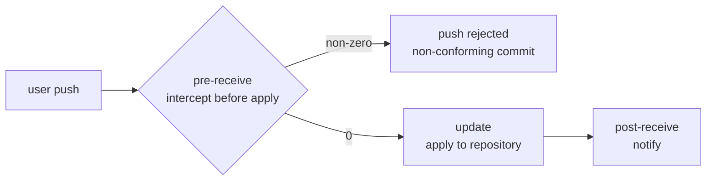

<p align="center">
  
</p>

<p align="center">
  <strong style="font-size: 1.5rem;">@7dgroup/dsh-skill-7d-git-commit</strong>
</p>

<p align="center">
  
  
  
  <a href="https://awesome-dsh-plugin.com"></a>
</p>

<p align="center">
  <strong>English</strong> | <a href="README.zh.md">中文</a>
</p>

# @7dgroup/dsh-skill-7d-git-commit

**Author: 7DGroup**

A DSH (DeepSeek Harness) bundle plugin that registers the `7d-git-commit` skill on `ctx.skills`. Before generating any `git commit` message, the skill validates it against the **7DGroup commit convention** and warns or guides the user to fix violations — a client-side guard that complements the server-side `pre-receive` hook on gitlab.

The bundled skill is a drop-in composition layer: install the bundle into a DSH profile and the skill becomes available in every session using that profile; remove the bundle to uninstall it cleanly.

---

## Project Info

| Field | Value |
|---|---|
| Author | 7DGroup |
| Version | 0.1.0-rc.3 |
| Runtime | Node `^22.19.0 || >=24.0.0` · pnpm 10+ · dsh CLI |
| Peer dependencies | `@deepseek-ai/cordis` · `@deepseek-ai/dsh-skill` · `@deepseek-ai/dsh-invariants` |
| Skill name | `7d-git-commit` |
| GitLab compatibility | GitLab CE 19.2.0 (server-side hooks) |
| Repository | [github.com/7dgroup-ai/dsh-skill-7d-git-commit](https://github.com/7dgroup-ai/dsh-skill-7d-git-commit) |
| License | MIT |

## Features

- **Client-side commit validation** before `git commit` is executed.
- **9 fixed Chinese type tags** such as `【新增】`, `【修复】`, `【优化】`, `【文档】`, etc.
- **Title length, punctuation, forbidden characters/phrases, and wording rules** from the 7DGroup convention.
- **Body formatting rules**: numbered lists, max 70 chars per line.
- **Exemptions** for merge commits and emergency `[skip-check]` deployments.
- **Bundled reference** `references/git-commit-message.md` acts as the source of truth and is loaded on demand.
- **Zero core changes** — pure composition bundle.

## Project Structure

```
dsh-skill-7d-git-commit/
├── src/
│   ├── index.ts              # Cordis plugin: registers the skill provider
│   └── invariant.ts          # Package-owned invariant companion
├── assets/7d-git-commit/
│   ├── SKILL.md              # Skill body (validation logic)
│   └── references/
│       └── git-commit-message.md   # 7DGroup commit convention reference
├── assets/images/
│   └── 7d-git-commit-cover.jpg     # README cover image
├── tests/
│   └── skill-7d-git-commit.spec.ts
├── cordis.patch.yml          # Composition layer patch
├── tsdown.config.ts          # Self-contained transpile config
├── package.json
└── README.md / README.zh.md
```

## Quick Start

Prerequisites: `dsh` CLI, Node `^22.19.0 || >=24.0.0`, pnpm 10+.

### Install via dsh CLI

```sh
dsh plugin --profile web add github:7dgroup-ai/dsh-skill-7d-git-commit
```

For the first git install, pnpm will refuse to run the build script until you add the exact package key to the profile's `pnpm-workspace.yaml` under `allowBuilds`. Then re-run the same command.

To avoid the build authorization, use a pre-built tarball or the published npm package:

```sh
dsh plugin --profile web add @7dgroup/dsh-skill-7d-git-commit
```

### Install from within a dsh session (recommended)

The most direct way — just ask the agent in any dsh conversation, and it runs the install for you. Use the GitHub spec — the npm name `@7dgroup/dsh-skill-7d-git-commit` only works after the package is published:

> 安装插件 github:7dgroup-ai/dsh-skill-7d-git-commit

(Or in English: "Install the plugin github:7dgroup-ai/dsh-skill-7d-git-commit" — the agent executes the equivalent `dsh plugin` command through its session shell.)

For a git install the agent will hit the same pnpm `allowBuilds` gate and print the exact key to add to the profile's pnpm settings file (`~/.dsh/profiles/<name>/pnpm-workspace.yaml`); after you add it, ask the agent to retry and the skill is enabled.

### Build and Test

```sh
pnpm install
pnpm build   # tsdown; also runs as `prepare` on git installs
pnpm test    # vitest
```

## Usage

Once installed, mention any commit-related request in a dsh session:

> Generate a commit message for the current changes.

You can also trigger the skill explicitly with the slash command:

> /7d-git-commit

Example triggers:

- Generate a commit message for the current changes.
- Write a commit message for these changes.
- Check whether my commit message follows the 7DGroup convention.
- Fix the commit message so it passes the validation rules.

The skill will:

1. Analyze the changes.
2. Choose the best matching type tag from the 9 allowed categories.
3. Compose a subject line (`【类型】动作 + 对象`) ≤ 50 chars without trailing punctuation.
4. Add a numbered body for complex changes, each line ≤ 70 chars.
5. Run the validation checklist and reject or fix violations.

## Commit Convention

See `assets/7d-git-commit/references/git-commit-message.md` for the full 7DGroup rules.

High-level requirements:

- Title format: `【类型】简短描述`
- Title length: ≤ 50 characters after the tag
- No trailing `。`, `，`, `.`, `,`
- Forbidden characters in title/body: `@ # $ % ^ & * ~`
- Forbidden phrases: temporary notes, TODO, FIXME, emotional language
- Body lines ≤ 70 chars, numbered list only

## GitLab Integration

The plugin provides both a client-side DSH skill and a server-side GitLab hook. Use them together for "client pre-check + server enforcement".

**Compatibility:** The server-side integration is adapted for and verified on **GitLab CE 19.2.0** (custom hooks + rule configuration).

- Client: `assets/7d-git-commit/SKILL.md` validates commit messages before `git commit`.
- Server: `docs/gitlab-integration/pre-receive` validates pushes before they reach GitLab.
- Rule source: `assets/7d-git-commit/references/git-commit-message.md` shared by both sides.

### Integration overview

#### Why validate commit messages

The first thing you do when receiving a new code drop is read the git log. A messy log that does not tell you what each commit actually did makes reviews and maintenance painful. Well-formed commit messages (a changelog) help others review the code, produce Release Notes efficiently, and matter greatly for version management. That is why we use GitLab server-side hooks to validate the git change log and block non-conforming commits.

#### Design: enforce at the `pre-receive` stage

GitLab runs three server-side hooks after a push (the flow the server performs):

| Hook | Stage | Role |
|------|-------|------|
| `pre-receive` | before push is applied | runs as soon as the push reaches the GitLab server — the interception point |
| `update` | during push | commits the update into the GitLab repository |
| `post-receive` | after push | runs after the push succeeds — used for notifications |

Flow:



Validating at the `pre-receive` stage: if a commit message does not conform, the hook exits with a non-zero code and the push never lands in the GitLab repository.

#### How it works

`pre-receive` reads the pushed refs from stdin as `oldrev newrev refname` (old commit id, new commit id, branch name), then uses `git log` to extract the author, date, and subject. A regex checks that the subject starts with an allowed prefix (the referenced article's example: `fix|add|del|update|temp|test|revert|Merge`); on mismatch it prints an error and `exit 1` rejects the push.

#### Manual deployment (per the referenced article)

1. **Locate the repository path**: GitLab switched to hashed storage, so get the on-disk path via an admin account, e.g. `/srv/gitlab/data/git-data/repositories/@hashed/78/5f/785f3ec7...git`.
2. **Create `custom_hooks`**: inside the repository directory, create a `custom_hooks` folder with a `pre-receive` file (a shell script).
3. **Make it executable**: `chmod +x pre-receive`.
4. **Verify with a local push**: non-conforming commits fail to push; conforming ones go through.

> The `docs/gitlab-integration/` directory in this repo is the productionized version of that approach: it iterates over every ref on stdin (not just the first line), supports warn/reject modes, externalizes rules into `commit-rules.conf`, and adds audit logging plus DingTalk reports — deployable with `install-hooks.sh` as shown below.

#### Pitfalls

GitLab versions bundle different git versions, and the same command can produce different output across them. For example, `git log --no-merges --date-order -1` output differs between git versions — do not rely on unverified command output in hooks.

> Reference article: [GitLab 服务端 hook 拦截提交到仓库](https://zuozewei.blog.csdn.net/article/details/122124164)

### Deploy server-side hooks

Copy `docs/gitlab-integration/` to the GitLab server, then run:

```sh
# single-repo pilot
sudo bash install-hooks.sh --pilot devops/7dgroup

# after pilot passes
sudo bash install-hooks.sh --global
```

### Rule synchronization

After updating `docs/gitlab-integration/commit-rules.conf` in this repo:

```sh
sudo bash scripts/sync-rules.sh --global --dry-run
sudo bash scripts/sync-rules.sh --global
```

### Observation and reporting

```sh
# daily summary
sudo bash scripts/audit-report.sh --markdown

# send to DingTalk
export DINGTALK_WEBHOOK="https://oapi.dingtalk.com/robot/send?access_token=xxx"
sudo -E bash scripts/dingtalk-notify.sh
```

### Switch to hard reject

1. Complete `docs/gitlab-integration/switch-to-reject-checklist.md`.
2. Change `MODE="reject"` in the deployed `commit-rules.conf`.
3. Take effect immediately on the next push.

For the full deployment SOP, see [`docs/gitlab-integration/deployment-guide.md`](./docs/gitlab-integration/deployment-guide.md).

## Notes

1. The provider contributes a single fixed skill and offers no runtime customization.
2. `prepare` does not emit type declarations; the dsh loader only needs the runtime entry.
3. The build only transpiles; type errors are visible in your editor but not checked during build.
4. The `docs/gitlab-integration/` files are not part of the DSH runtime bundle; copy them to the GitLab server on demand.

## License

[MIT](LICENSE) · Copyright (c) 2026 7DGroup
