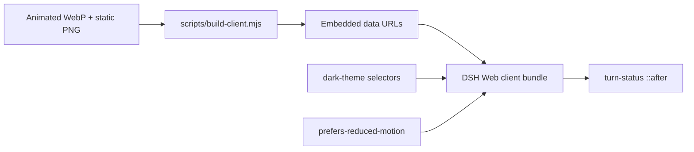

<p align="center">
  
</p>

<p align="center">
  <a href="https://awesome.re"></a>
  <a href="https://awesome-dsh-plugin.com"></a>
  <a href="LICENSE"></a>
  
  
  
</p>

<p align="center">
  <strong>A persistent, theme-aware monochrome whale-dive animation beside the DeepSeek Harness turn status.</strong><br />
  Closed-loop playback, no runtime network requests, and a static fallback for reduced-motion users.
</p>

<p align="center">
  English · <a href="README.zh-CN.md">简体中文</a>
</p>

## Preview

<p align="center">
  
</p>

> The preview has 60 frames at the production 33 ms cadence, with no extra in-between frames. v0.3.0 uses a compact head, lifted snout, eye, mouth, and short fluke while the torso and tail remain articulated frame by frame.

## Screenshots

<table>
  <tr>
    <td width="33%"></td>
    <td width="33%"></td>
    <td width="33%"></td>
  </tr>
  <tr>
    <td align="center"><strong>01 — Breach</strong></td>
    <td align="center"><strong>02 — Apex</strong></td>
    <td align="center"><strong>03 — Deep dive</strong></td>
  </tr>
</table>

Each screenshot is rendered from the committed `assets/whale-dive.webp`, so the gallery represents the frames users actually receive—not separate concept art. The generated hero, preview, and gallery use shared English captions in both README translations so they remain one reproducible visual artifact; the surrounding descriptions and alt text are localized.

## Highlights

| | Feature | What it means |
|---|---|---|
| 🌊 | **Propagating water surface** | Breach and entry produce travelling crests, recoil, and damped settling instead of a frozen waterline. |
| 🐋 | **Original articulated whale** | A compact head, lifted snout, eye, mouth, and short fluke remain legible while the torso and tail flex through the loop. |
| 🌗 | **Theme aware** | The whale uses its normal monochrome treatment in light mode and is inverted for `prefers-color-scheme: dark`, `html.dark`, and `html[data-theme="dark"]`. |
| 📦 | **Self-contained bundle** | Animated WebP and PNG fallback are embedded in the built client; no runtime URL or source-frame directory is required. |
| ♿ | **Reduced-motion aware** | `prefers-reduced-motion` switches the animation to the included static PNG. |
| ⚙️ | **Zero configuration** | Size, offset, selector, and animation assets are fixed at build time; customization means rebuilding `lib/client.js`. |
| 🎯 | **Strictly visual scope** | Decorates only the Web turn-status surface; it has no settings, model tools, storage, workspace access, network calls, or user-content processing. |
| ♻️ | **Lifecycle-clean and idempotent** | Activation removes an older plugin style before adding one owned by the Cordis client fiber; stop or uninstall removes it completely. |
| 🔌 | **Web-profile declaration** | The `dsh.bundle` manifest and `cordis.patch.yml` declare the browser client for automatic Web-profile mounting when DSH loads the bundle. |

## Install

Install directly from GitHub into the DSH Web profile:

```powershell
dsh plugin --profile web add github:LeemanCheung/dsh-whale-animation
```

Then hard-refresh the DSH Web page. Restart DSH if the running profile has already cached its client bundle.

For the current release, pin `#v0.3.0`:

```powershell
dsh plugin --profile web add github:LeemanCheung/dsh-whale-animation#v0.3.0
```

### Uninstall

```powershell
dsh plugin --profile web remove dsh-whale-animation
```

## Animation profile

| Property | Value |
|---|---:|
| Source canvas | 352 × 352 px (displayed at 84 × 84 CSS px) |
| Animation frames | 60 |
| Frame duration | 33 ms |
| Loop duration | 1.980 s |
| Encoding | Animated RIFF WebP |
| Reduced-motion asset | PNG |
| Runtime asset requests | None |

`npm run check` verifies client registration and disposal, RIFF/WebP framing, 60 × 33 ms animation timing, embedded WebP/PNG data URLs, the 84 px layout rule, and the dark-theme CSS rule. It does not score artistic continuity or prove the source artwork is unique.

`python scripts/check-readme-assets.py` independently verifies the generated 1200 × 380 hero, 1000 × 320 60-frame preview and 1.980 s timing, the three 900 × 520 screenshots, the preview size budget, local README links, and one Mermaid diagram per README.

These are static bundle/asset checks. The release has not been installed and activated in a real DSH Web profile as part of this verification, so automatic mounting and live GUI rendering remain manifest/source-derived behavior rather than end-to-end evidence.

## How it works



`lib/index.js` is an intentional no-op Host entry: all behavior runs in the browser through the package's `dsh.client` Web registration. Both assets are embedded as data URLs in `lib/client.js`, so activation does not depend on the repository checkout after installation.

The client first removes an existing `style[data-plugin="dsh-whale-animation"]`, then adds one style through `ctx.effect()` and removes it on disposal. The CSS targets the current hashed turn-status class plus the `[class*="_turnStatus"]` fallback, clears that element's `::before` content, and paints a non-interactive 84 × 84 px `::after` 6 px to its right. This broad fallback and the two pseudo-elements can conflict with a future Shell refactor or another plugin that styles the same surface.

Dark-mode selectors invert the monochrome artwork; `prefers-reduced-motion` swaps in the PNG. There is no settings UI or runtime configuration—the size, offset, selectors, and assets are generated into `lib/client.js`.

## Development

Requirements: **Node.js 20+**. Rebuilding README artwork additionally needs Python 3, Pillow, and NumPy:

```powershell
python -m pip install Pillow numpy
npm run build
npm run check
python scripts/build-readme-assets.py
python scripts/check-readme-assets.py
```

`npm run check` validates only the client bundle; artwork/link validation is a separate Python command and should be run as shown before publishing docs. The artwork generator prefers the Windows Segoe UI font files when present and otherwise falls back to Pillow's default font, so byte-identical regenerated artwork is currently Windows-dependent.

### Repository layout

```text
assets/
  whale-dive.webp        Full animated asset
  whale-static.png       Reduced-motion fallback
docs/
  hero.png               README hero artwork
  preview.webp           Lightweight animated README preview
  screenshots/           Breach, apex, and deep-dive frame gallery
lib/
  index.js               Intentional no-op Host entry
  client.js              Prebuilt DSH browser client
scripts/
  build-client.mjs       Embeds source assets into the client
  build-readme-assets.py Rebuilds repository artwork from the real animation
  check-readme-assets.py Validates artwork timing, size, and README links
  check.mjs              Validates registration, lifecycle, and embedded assets
cordis.patch.yml         Persistent DSH bundle composition patch
```

`lib/client.js` is committed intentionally: GitHub installs work without a package build or external asset fetch.

## Compatibility

- Targets the **DeepSeek Harness Web UI** only and requires a DSH version compatible with `@deepseek-ai/dsh-client-runtime ^0.1.0-rc.6`.
- Uses the current hashed turn-status class and a `[class*="_turnStatus"]` fallback. A Shell DOM/class or pseudo-element redesign may require a selector update; plugins that also own that target's `::before` or `::after` can conflict.
- Light, OS-dark, `html.dark`, and `html[data-theme="dark"]` modes are covered by CSS inversion; reduced motion receives the static PNG. The plugin does not offer runtime settings, and its 84 px size/right-side offset are build-time constants.

## Attribution

This project is independent and is not affiliated with or endorsed by DeepSeek. The animation is an original UI illustration designed to harmonize with DeepSeek Harness' whale-themed status experience. See [NOTICE.md](NOTICE.md) for visual-design and trademark details.

## License

Released under the [MIT License](LICENSE).
