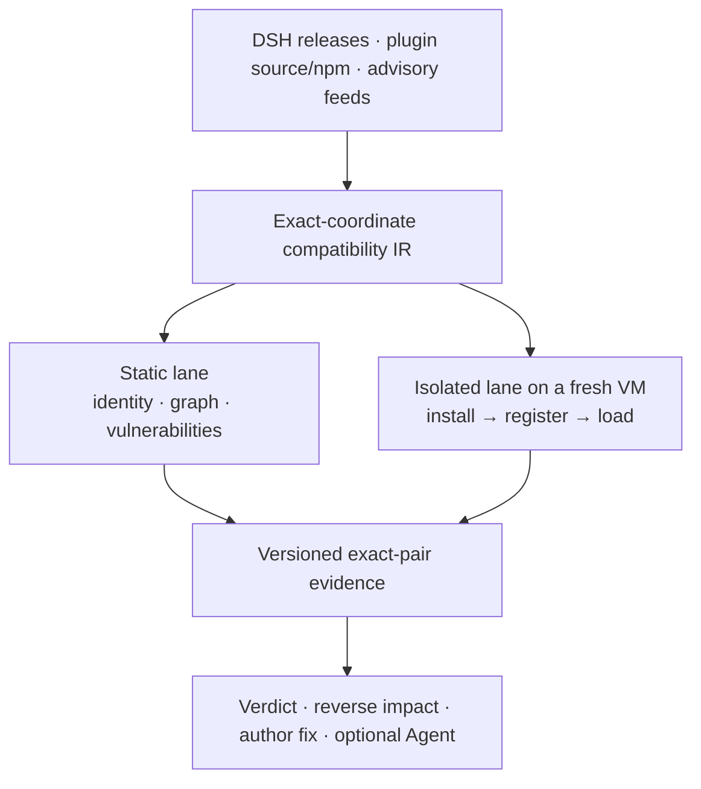

# Upstream Radar

[](https://github.com/MicroMilo/upstream-radar/actions)
[](https://www.npmjs.com/package/upstream-radar)
[](https://github.com/MicroMilo/upstream-radar/stargazers)
[](LICENSE)

**Compatibility evidence for the [DeepSeek Harness (DSH)](https://github.com/deepseek-ai/deepseek-harness) plugin ecosystem.**

A plugin repository can look healthy while its published artifact cannot install
on the current DSH runtime. Upstream Radar binds the exact plugin artifact, DSH
release, Node runtime, dependency graph, and install policy into one reviewable
compatibility record—then identifies which plugins and authors are affected when
that evidence changes.

The core object is an exact environment, not a package name or a diff:

```text
plugin tarball SHA-256 × DSH version × Node/pnpm baseline × approved dependency builds
```

## How the system fits together



Radar establishes deterministic facts; the Agent interprets project impact. A
model never decides whether versions match, invents a dependency path, or turns
missing evidence into a green result.

## What it answers

| Question | Evidence returned |
| --- | --- |
| Does this exact plugin work with this DSH release? | Tarball identity, Node contract, install, registration, and load result. |
| Why did it fail? | The failed stage, bounded command evidence, required build approval, or incompatible runtime range. |
| What enters the DSH profile? | Exact npm/pnpm nodes, duplicate versions, root-to-dependency paths, and unresolved edges. |
| Which plugins are exposed to an upstream change? | A reverse index with every known downstream path and its coverage status. |
| What can the author repair? | The concrete package, version, lockfile, DSH declaration, or installation contract involved. |

## Proven on real DSH plugins

- Imported a commit-pinned cohort of **8 repositories** from
  [`awesome-dsh-plugin`](examples/dsh/awesome-observer/README.md); 6 independently
  matched npm artifacts enter the isolated matrix and 2 remain correctly
  GitHub-only.
- Tested **9 exact artifacts** against DSH `0.1.1-rc.1` in separate disposable
  VMs. Eight installed, registered, and loaded under their recorded contracts.
- Stopped `@zseven-w/dsh-openpencil@0.1.0-rc.1` before plugin execution because
  its artifact requires Node `>=24.11.0` while the runner provides Node `22.23.2`.
- Proved `dsh-better-sidebar@0.14.0` succeeds only after the documented
  `node-pty` build is explicitly approved and the native toolchain is present.
- Built a reverse index from **37 real plugin graphs and 1,025 dependency
  coordinates**, while preserving 13 missing-graph targets as evidence gaps.

Read the [live isolated matrix and negative controls](examples/dsh/install-observer/reports/2026-08-21-dsh-0.1.1-rc.1.md)
or inspect the [first 50-plugin corpus](examples/dsh/first-batch/README.md).

## Try it in 60 seconds

```bash
# Network-free product walkthrough
npx --yes upstream-radar@0.40.0 demo

# Static review of a public DSH plugin; no install or plugin execution
npx --yes upstream-radar@0.40.0 scan \
  https://github.com/PlutoKeating/dsh-lark-bot \
  --fail-on never

# Exact artifact review plus a DSH load matrix
npx --yes upstream-radar@0.40.0 review dsh-plugin \
  dsh-cloudflare-browser-run@0.1.3 \
  --dsh-version 0.1.0-rc.8,0.1.1-rc.1
```

The code-executing path is deliberately separate. Run **Actions → Observe one
DSH plugin install** to give one exact pair its own secret-free GitHub-hosted VM
and restricted container.

## Always-on today

The scheduled observer watches 13 DSH/core/plugin targets and stores the last
trusted source, npm, lockfile, and alignment observations. A new exact DSH
publication selects the maintained plugin matrix; a mapped plugin publication
selects that plugin. Only affected pairs enter the isolated runtime lane.

When nothing changed, Radar stays quiet: the verified steady-state run produced
no Agent call, no install job, and no timestamp-only state commit.

**Current boundary:** unchanged plugin/DSH pairs retain their previous evidence;
the current scheduler does not yet periodically re-run every existing pair.

## Safety boundary

| Radar does | Radar does not claim |
| --- | --- |
| Static graph and artifact checks without importing plugin code | An empty finding list proves safety |
| Dynamic checks in a fresh VM and restricted, secret-free container | A shared-kernel container proves hostile code is harmless |
| Exact-version advisory matching and dependency paths | Every matched plugin is exploitable |
| Exact-pair compatibility results with explicit coverage | One successful load covers every plugin business action |

## Use it in DSH or CI

```bash
# Generate a reviewable DSH inventory and wiring
npx --yes upstream-radar@0.40.0 setup
```

The repository also ships a [reusable GitHub Action](action.yml), maintained
[observer workflow](.github/workflows/upstream-observer.yml), and machine-readable
[schemas](schemas/). See the [Chinese guide](docs/README.zh-CN.md) for complete
configuration and [architecture notes](docs/architecture.md) for evidence and
trust boundaries.

## Development

```bash
pnpm install
pnpm test
pnpm run release:check
```

Apache-2.0 licensed. Contributions backed by a reproducible DSH plugin case are
especially welcome.
